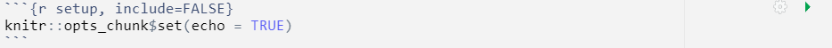
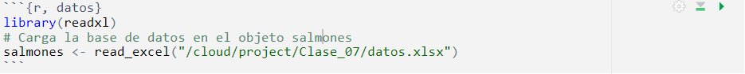

<style>
#TOC {
  color: black;
  font-familiy: Calibri;
  font-size: 14px;
  border-color: #708090; 
}
body {
   color: black;
   font-familiy: Calibri;
}

pre {
  color: black;
  background-color: #F8F8FF;
}
# header {
  color: #800000;
  font-familiy: Calibri;
  background-color: #F5F5F5;
  opacity: 0.8;
  font-size: 16px;
}
</style>

## Encabezado YAML **Metadata**

Este script contiene toda la información necesaria para generar un reporte dinámico en formato **html**. Al inicio de este documento usted puede observar el **metadata** en formato **YAML**. Note que está formado por las siguientes partes:

      ---
      title: "Sintaxis de Rmarkdown"
      author: "Su nombre"
      date: "`r format(Sys.time(), '%d %B %Y')`"
      output:
        html_document
      subtitle: "Diplomado en Análisis de datos con R para la Acuicultura."
      ---

* Título (title). Texto entre comillas que servirá de título general al documento.
* Autor (author). Texto entre comillas para indicar el nombre del o los autores.
* Fecha (date). Campo para indicar la fecha. Está en formato de fecha dinámica, que establece la fecha del día que se imprime el reporte.
* Salida (output). Indica el formato preestablecido para compilar el documento. En este caso, se trata de un html. 
* Subtítulo (subtitle). Texto entre comillas que servirá de subtítulo para el título general del documento.

# Markdown

Este texto que usted lee ahora se denomina markdown y puede modificarlo a voluntad cuando escriba un reporte, agregando todo tipo de formatos, así como tablas, listas, párrafos o referencias. 


# **Nivel de títulos**

En markdown # indica un título.

Para reducir el tamaño de los títulos se van agregando más #

    # Titulo 1 (Nivel de mayor jerarquía)
    ## Título 2 (Nivel de segunda jerarquía)
    ### Título 3 (Nivel de tercera jerarquía)
    
# Título 1
## Título 2
### Título 3

________________________________________________________________________________________________

# **Viñetas o listas**

Puede agregar listas como lo hace habitualmente en word.

## **Construcción de una lista sin números**

    - Elemento 1
    - Elemento 2
    - Elemento 3
    
- Elemento 1
- Elemento 2
- Elemento 3

## **Construcción de una lista numerada**

    1. Elemento 1
    2. Elemento 2


1. Elemento 1
2. Elemento 2

_______________________________________________________________________________________________

# **Formato de palabras o frases**

Puede dar formato de negrita o cursiva usando uno o dos ** a cada lado de la palabra.

    **Esto va en negrita**  
    *Esto va en cursiva* 
    **_Esto va en negrita y cursiva a la vez_**
    
**Esto va en negrita**  
*Esto va en cursiva*  
**_Esto va en negrita y cursiva a la vez_**

_____________________________________________________________________________________________

# **Enlaces** 

Para ingresar un enlace asociado a una palabra, se debe encerrar la palabra o palabras 
que queremos enlazar dentro de corchetes y seguido entre paréntesis el enlace, por ejemplo: 

    [**Rmarkdown**](https://www.rstudio.com/wp-content/uploads/2015/03/rmarkdown-reference.pdf)

[**Rmarkdown**](https://www.rstudio.com/wp-content/uploads/2015/03/rmarkdown-reference.pdf)

________________________________________________________________________________________________

# **Crear tablas sencillas en Rmarkdown **

Puede crear tablas usando barras espaciadoras y guiones como en el siguiente ejemplo

    | Variable A | Variable B | Variable C |
    | :-- | :--: | --: |
    | A1 | B1 |  C1 |
    | A2 | B2 | C2 |
    
| Variable A | Variable B | Variable C |
| :-- | :--: | --: |
| A1 | B1 |  C1 |
| A2 | B2 | C2 |

Para generar tablas sencillas de una forma fácil, podrías usar el siguiente generador de tablas [**Tables Generator**](https://tablesgenerator.com/markdown_tables#)

_______________________________________________________________________________________________

# **Inclusión de fórmulas**

La forma de incluir fórmulas matemáticas en R Markdown se basa en la sintaxis del sistema de composición de textos científicos LATEX.

* Para las fórmulas o ecuaciones dentro del mismo párrafo, se escribe el código entre dos signos pesos

Por ejemplo la inclusión de la siguiente fórmula (**Rango intercuartílico (IQR)**):


      $IQR = Q3-Q1$

$IQR = Q3-Q1$


* Para las fórmulas o ecuaciones aparezcan centradas en una línea aparte, se debe escribir el código entre dos dobles $:


      $$IQR = Q3-Q1$$

$$IQR = Q3-Q1$$

# **Bloques de código o chunk**

La principal diferencia de Markdown con Rmarkdown es obviamente la posibilidad de incluir códigos de R para analizar datos. Esto se consigue agregando bloques de códigos como el que se muestra a continuación. Observe con detenimiento que el bloque de códigos comienza y termina con 3 tildes invertidas **```** y que al inicio hay una r entre dos **{}** lo que indica al software que es un código de **R**. Éste primer bloque es para configurar el resto de los bloques de código, por eso se ha incluido un nombre **setup**. En este primer **chunk** puede ver el llamado a ejecutar la librería **knitr**.
_________________________________________________________________________________________________

* Este bloque de códigos se llama setup y configura el resto de los bloques.

* El comando include=FALSE da la instrucción de que éste bloque no aparezca en el reporte.

* El comando echo=TRUE da la instrucción de que los siguientes bloques si aparezcan en el reporte.


```{r, echo=FALSE, out.width = '100%', fig.align='center'}

```
_________________________________________________________________________________________________


Cuando trabajes con bloques de códigos para analizar tus datos, también puedes agregar el nombre del bloque del código, en este caso usaremos de ejemplo el set de datos **datos.xlsx**. 

Mientras que para ejecutar un bloque de código, debes presionar **la punta de flecha verde o play** que se observa en la parte superior derecha del mismo bloque de códigos.

## **Cargar base de datos**

_________________________________________________________________________________________________

```{r, echo=FALSE, out.width = '100%', fig.align='center'}

```

```{r, datos}
library(readxl)
# Carga la base de datos en el objeto salmones
salmones <- read_excel("/cloud/project/Clase_07/datos.xlsx")
```

_________________________________________________________________________________________________

```{r, resumen salmones}
# Este bloque de códigos se llama resumen salmones.
summary(salmones)
```

# **Insertar gráficos dentro de un Chunk**

También puedes incluir y dar nombre a las gráficas en el mismo bloque de código usando el comando **fig.cap=""**.

```{r gráfica salmones, echo=TRUE, fig.cap="Peso en función del Sexo.",fig.align='center'}

# Este bloque de códigos se llama gráfica salmones.

# El comando echo=TRUE hace que se imprima el bloque en el reporte.

# El comando fig.cap="" sirve para colocar el epígrafe de la figura.

# El comando fig.align='center' sirve para centrar la figura.

boxplot(salmones$Peso~salmones$Sexo, col="seagreen2", xlab= "Sexo", ylab="Peso (gr)")

```

# **Generar tablas a partir de una base de datos dentro de un Chunk**

Existen varias formas de hacer tablas en Rmarkdown y paquetes asociados para cada función que permite la generación de tablas. Algunos paquetes que se usan o están vinculados con la generación de tablas son **kableExtra**, **knitr**, **tidyverse**, **pander**, **DT**, entre otros. Cuando queremos generar tablas pequeñas en **html** se recomienda usar las funciones **_knitr::kable()_**, **_kbl()_** o **_pander()_**. En el caso de hacer tablas con muchas información en **html**, lo recomendado es usar la función **_DT::datatable()_**.

## 1). Con función **kable**

```{r}
library(kableExtra)
library(knitr)

knitr::kable(head(salmones), caption = "Peso en función del Sexo.","simple", align ="lrrc")

```

## 2). Con función **kbl**

```{r, message=FALSE, error=FALSE, warning=FALSE}
library(tidyverse)
library(kableExtra)

kbl(head(salmones), caption = "Peso en función del Sexo.",align ="lccc") %>% kable_classic(full_width = F, html_font = "Cambria")

```

## 3). Con función **pander**

```{r, message=FALSE, error=FALSE, warning=FALSE}
library(pander)

pander(head(salmones), caption = "Peso en función del Sexo.",align ="lccc") 
```

## 4). Con función **datatable**

```{r, message=FALSE, error=FALSE, warning=FALSE}
library(DT)

DT::datatable(salmones, caption = "Peso en función del Sexo.") 
```


Para ver más formas de hacer tablas para archivos .html, [**Tablas Html**](https://cran.r-project.org/web/packages/kableExtra/vignettes/awesome_table_in_html.html)

________________________________________________________________________________________________


# **Paquetes de R**

Una de las fortalezas de R es que existen miles de paquetes para realizar análisis de datos. Algunos están pre-instalados pero otros no.

A continuación, se presentan algunos comandos para revisar los paquetes que están instalados y habilitados para trabajar.

```{r librerias habilidatas}
# Este comando permite revisar que paquetes están "habilitados"
# y listas para usar en tu ambiente de trabajo.
search()
```

_________________________________________________________________________________________________


### **Compilar el reporte**

Finalmente, para poder generar un reporte debes presionar el **triángulo negro** que está junto a la palabra **Knit** en la parte superior de este documento. Si presionas **Knit to HTML**, esto indicará al paquete **knitr** que debe leer el presente documento, interpretar y ejecutar el metadata, el texto de bajo nivel y los diferentes bloques de código para elaborar el reporte html.

Para más detalles de como trabajar con Rmarkdown investigue el siguiente [link](https://swcarpentry.github.io/r-novice-gapminder-es/15-knitr-markdown/).


