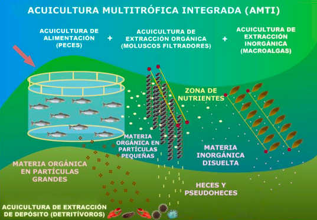
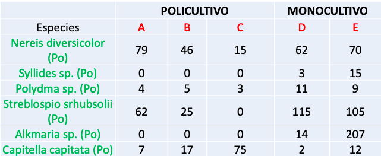
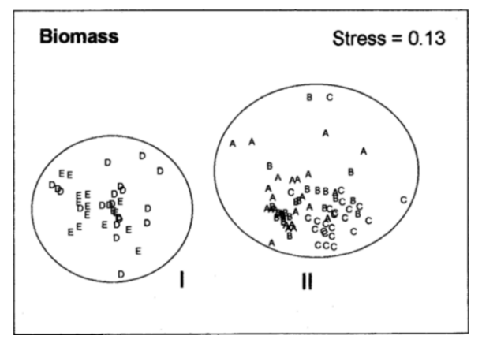

```{r setup, include=FALSE}
knitr::opts_chunk$set(echo = FALSE)
library(readxl)
library(ggplot2)
library(dplyr)
library(knitr)
library(kableExtra)
```

# PLAN DE LA CLASE

**1.- Introducción**
    
- ¿Qué son los análisis multivariantes?.
- Estudio de caso: Fauna béntica como indicador de calidad ambiental.
- Matrices de distancia.
- Análisis de cluster: jerárquico y no jerárquico.

**2). Práctica con R y Rstudio cloud.**

- Matriz de distancia: cálculo con R.
- Análisis de cluster.

# INRRODUCCIÓN ANÁLISIS MULTIVARIANTE

**¿Qué son los análisis multivariantes?**   
Conjunto diverso de métodos estadísticos que estudian y examinan el efecto simultáneo de múltiples variables.

```{r, echo=FALSE, out.width = '70%' }
bioenv <- read_excel("bioenv.xlsx", sheet = 1)
tabla <- bioenv %>% select(a,b,c,d,e,Depth,Pollution,Temperature)
kable(head(tabla))
```

# TIPOS DE MÉTODOS MULTIVARIANTES

```{r, echo=FALSE, out.width = '90%' }
knitr::include_graphics("metodos.png")
```

Fuente: [Multivariate Statistic, 2014](https://www.fbbva.es/microsite/multivariate-statistics/legal.html)

# MÉTODOS MULTIVARIANTES SEGÚN TIPO DE VARIABLE

```{r, echo=FALSE, out.width = '90%' }
knitr::include_graphics("4esquinas.png")
```

Fuente: [Multivariate Statistic, 2014](https://www.fbbva.es/microsite/multivariate-statistics/legal.html)


# ESTUDIO CASO: BENTOS Y AMBIENTE

```{r, out.width='70%'}

```

[Fuente FOTO: Mesa Merelo. 2014](https://rodin.uca.es/bitstream/handle/10498/20137/TFM%20Mesa%20Melero.pdf?sequence=1&isAllowed=y)

# ESTUDIO CASO: DATOS MULTIVARIADOS

- Análisis del bentos.  
- 21 variables respuesta (especies + biomasa) por tipo de cultivo y sitio.

```{r, out.width='90%'}

```

[Fuente: Drake and Arias. 1997](https://doi.org/10.2307/1352243)

# ESTUDIO CASO: ANÁLISIS DE CLUSTER

- Análisis de cluster revela 2 grupos asociados al tipo de cultivo.
```{r, out.width='70%'}

```

Fuente: [De los Ríos-Escalante et al. 2013](https://www.scielo.cl/scielo.php?script=sci_arttext&pid=S0718-560X2013000500005)

 
# ANÁLISIS DE CLUSTER

**¿Qué son?**: Herramientas de exploración que permiten agrupar y visualizar datos multivariados con base a su similitud (matriz de distancia).

**Jerárquico**: Los grupos se fusionan sucesivamente siguiendo una jerarquía de similitud (mayor a menor). 

**No jerárquico**: Se forman grupos homogéneos sin establecer jerarquía  entre ellos.

```{r, echo=FALSE, out.width = '60%' }
knitr::include_graphics("Cluster_clasificacion.png")
```

Fuente: [Multivariate Statistic, 2014](https://www.fbbva.es/microsite/multivariate-statistics/legal.html)

# VENTAJAS Y DESVENTAJAS

|  Tipo |  Ventajas |
|:---:|:---:|
|  Jerárquico |  No requiere especificar grupos al inicio|
|  No jerárquico |  Útil cuando existen muchos elementos |

|  Tipo |  desventajas |
|:---:|:---:|
|  Jerárquico |  Difícil decidir que grupos son relevantes y cuales no.|
|  Jerárquico |  Difícil de interpretar cuando existen muchos 	elementos. |
|  No jerárquico |  El número de cluster que se define al inicio, podría no ser el adecuado. |

# ANALISIS JERÁRQUICO: MÉTODO

**¿Qué hace el algoritmo estándar?**  
	1. Agrupa dos elementos por su similitud (distancia).  
	2. Recalcula la matriz de distancia (muchas opciones).  
	3. Vuelve a punto 1.  
	4. Finaliza cuando todos los elementos han sido asignados a cluster.  

**¿Cómo recalculo la matriz?**   
1. Método de distancia máxima (vecino más lejano).   
2. Método de distancia mínima (vecino más próximo).  
3. Método UPGMA (unweighted Pair-group arithmetic averages).  


# MATRIZ DE DISTANCIA O SIMILARIDAD

**¿Qué es y para que sirven?**  
- Las matrices de distancia o similaridad están en la base de todos los análisis multivariados de estructura. 

**Algunas consideraciones**  
- Las matrices de distancia se pueden elaborar tanto para variables cuantitativas continuas, como discretas.

- Debido a que las variables pueden tener diferente escala o magnitud es necesario muchas veces transformar o estandarizar las variables antes de calcular las matrices de distancia.

- Cuando una variable tiene muchos ceros también es conveniente transformarla.

# TIPOS DE MATRICES DE DISTANCIA 

- **Euclideana**: Para variables cuantitativas continuas.  
  Con base en el teorema de pitágoras  
  $c^2= a^2 +b^2$  
  $a= \sqrt{c^2-b^2}$  
  $b= \sqrt{c^2-a^2}$  
  $c= \sqrt{c^2+b^2}$  

- **No euclideana**: Para variables cuantitativas discretas.  
 a) Bray-Curtis (datos de conteo).  
 b) Jacard (binarias). 
 
# EJEMPLO ESTUDIO DIVERSIDAD BENTOS

- ¿Cuán similares son las muestras entre si?
- ¿Qué muestras pertenecen a un mismo grupos (variable latente)?

```{r, echo=FALSE, out.width = '90%' }
knitr::include_graphics("Abundancia.png")
```

Fuente: [Multivariate Statistic, 2014](https://www.fbbva.es/microsite/multivariate-statistics/legal.html)

# INDICE DE JACARD

Índice de Similitud de Jaccard se usa para expresar el grado en que dos muestras son semejantes por las especies presentes en ellas. 

- Co-presencias (a)
- Co-ausencias (d)
- No coincidentes (b + c)

```{r, echo=FALSE, out.width = '90%' }
knitr::include_graphics("Jacard.png")
```


# CALCULE INDICE DE JACARD

```{r, echo=FALSE, out.width = '90%' }
knitr::include_graphics("Jacard_ejemplo.png")
```

# MATRIZ DE SIMILARIDAD DE JACARD

```{r, echo=FALSE, out.width = '100%' }
knitr::include_graphics("Jacard_matriz.png")
```

# AGRUPAMIENTO JERARQUICO: PASO 1

Construcción del primer nodo: Mayor similitud entre B y F

```{r, echo=FALSE, out.width = '100%' }
knitr::include_graphics("Paso1.png")
```

# AGRUPAMIENTO JERARQUICO: PASO 2

```{r, echo=FALSE, out.width = '90%' }
knitr::include_graphics("Paso2.png")
```

# AGRUPAMIENTO JERARQUICO: PASO 2.1

```{r, echo=FALSE, out.width = '90%' }
knitr::include_graphics("Paso2.1.png")
```

# AGRUPAMIENTO JERARQUICO: PASO 2.2


```{r, echo=FALSE, out.width = '90%' }
knitr::include_graphics("Paso2.2.png")
```

# AGRUPAMIENTO JERARQUICO: PASO 3

```{r, echo=FALSE, out.width = '100%' }
knitr::include_graphics("Paso3.png")
```

# AGRUPAMIENTO JERARQUICO: PASO 4

```{r, echo=FALSE, out.width = '90%' }
knitr::include_graphics("Paso4.png")
```

# AGRUPAMIENTO JERARQUICO: PASO 4.1

```{r, echo=FALSE, out.width = '90%' }
knitr::include_graphics("Paso4.1.png")
```

# AGRUPAMIENTO JERARQUICO: PASO 5

Construcción del tercer nodo: Mayor similitud entre C y G

```{r, echo=FALSE, out.width = '100%' }
knitr::include_graphics("Paso5.png")
```

# AGRUPAMIENTO JERARQUICO: PASO 6

Construcción del cuarto nodo: Mayor similitud entre A-E y C-G

```{r, echo=FALSE, out.width = '100%' }
knitr::include_graphics("Paso6.png")
```

# AGRUPAMIENTO JERARQUICO: PASO 7

Construcción del quinto y sexto nodo: Mayor similitud entre A-E-C-G con B-F y entre estos con D.


```{r, echo=FALSE, out.width = '100%' }
knitr::include_graphics("Paso7.png")
```


# INTERPRETACIÓN CLUSTER JERÁRQUICO

- Establecemos nivel de agrupamiento = 0.5.
- Bajo 0.5 hay mas similaridad (Co-presencias).
- Se observan 3 grupos o cluster.

```{r, echo=FALSE, out.width = '50%' }
knitr::include_graphics("Dendograma.png")
```

# RESUMEN DE LA CLASE

- ¿Qué son los análisis multivariantes?.
- Estudio de caso  1: Fauna béntica como indicador de calidad ambiental.
- Matrices de distancia (Variables discretas): Jacard.
- Análisis de cluster: jerárquico y no jerárquico.
