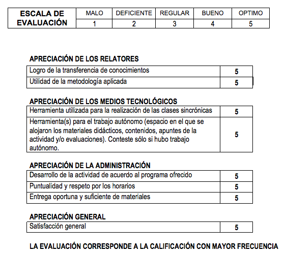
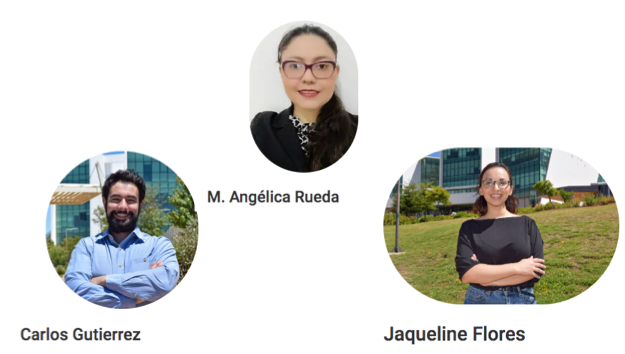
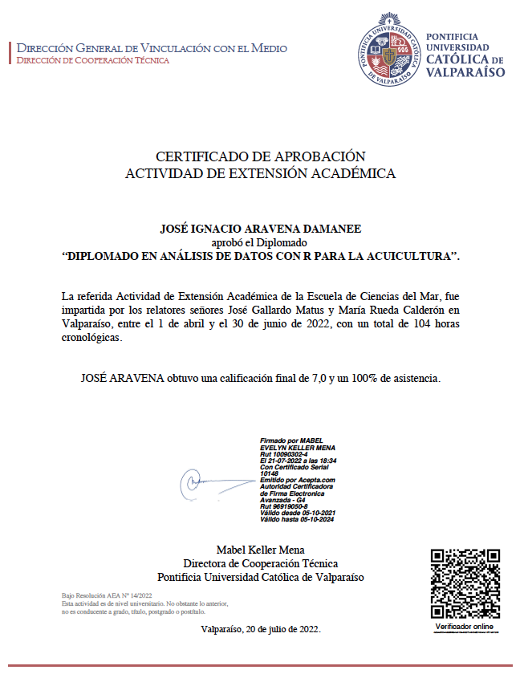
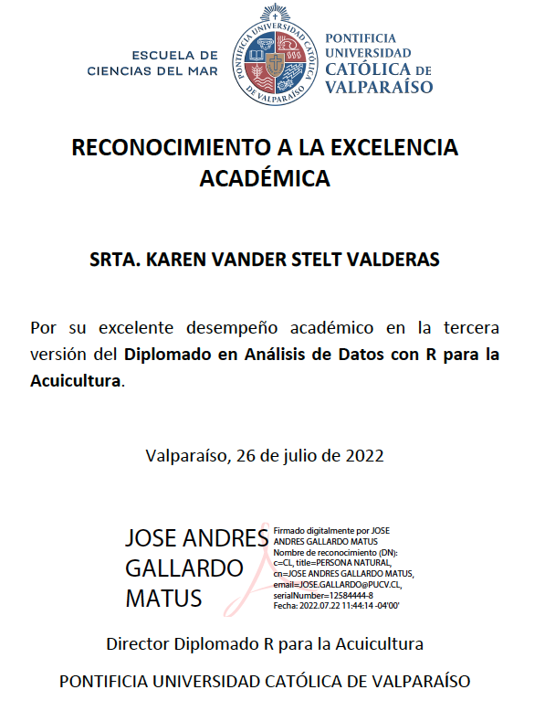

```{r setup, include=FALSE}
knitr::opts_chunk$set(echo = FALSE)
```

# PLAN DE LA CEREMONIA DE CIERRE

- Palabras Director del Diplomado.

- Palabras Director del Doctorado.

- Entrega certificados graduados.

- Reconocimiento de excelencia académica.

- Palabras de cierre.


# PALABRAS DIRECTOR DIPLOMADO

**Programa consolidado**  
1ra y 2da versión: 45 graduados.    
3ra versión: 22 graduados.  
Total: 67 graduados.  

**Perfil del graduado**  
Chile: 70 %  
Ecuador: 7 %  
México: 7 %  
Perú: 7 %  
Colombia: 5 %  
Venezuela: 1 %  
Argentina: 1 %    
Hombres: 66 %  
Mujeres: 34 %  

# EVALUACIÓN DIPLOMADO

```{r, echo=FALSE, out.width = '60%' }

```

# AGRADECIMIENTO AL EQUIPO

```{r, echo=FALSE, out.width = '80%' }

```

# PALABRAS DIRECTOR DOCTORADO

- **Dr. Felipe Hurtado**  
Jefe de Vinculación con el Medio.  
Director del Doctorado en Acuicultura.

- **Acreditación**  
Doctorado en Acuicultura acreditado por 5 años.  
64 graduados: 45 chilenos - 19 extranjeros.  
Postulaciones en Octubre 2023. 

- **Becas otorgadas para el diplomado v1-v3**   
BECA YO SOY ACUICULTOR (30%): 61   
BECA ALUMNI PUCV (40%): 5    
BECA FUNCIONARIO PÚBLICO (50%): 8    
BECA EXCELENCIA ACADÉMICA (90-100%): 6    

# CERTIFICADOS DE APROBACIÓN
```{r, echo=FALSE, out.width = '70%' }

```

# GRADUADOS GRUPO 1
Alain Fabian Muñoz Faundez  
André Guillermo Muñoz Herrera  
Carolina San Martin Rodríguez  
Constanza Pino Asenjo  
Cristian Andres Naguian Asenjo  
Eduardo Antonio Henríquez Tejo  
Fabian Andres Villarroel Carvajal  
Felipe Ignacio Tucca Díaz  
Francisco Vásquez Estrada  
Gabriela Salas Serqueira  
Hugo Alexander Jaramillo Torres  

# GRADUADOS GRUPO 2
Jorge Eduardo Pino Marambio  
José Ignacio Aravena Damanee  
Juan José Rodríguez Maulén  
Karen Vander Stelt Valderas  
Luis Fabián Canosa Trillo  
Marco Antonio Imués Figueroa  
Pedro Enrique Pizarro Rojas  
Roberto André Terán Gonzalez  
Sergio Segundo Silva Palma  
Yasna Arleth Molina Carvajal  
Yessica Lisette Ortega Asencios  

# DIPLOMAS EXCELENCIA ACADÉMICA
```{r, echo=FALSE, out.width = '60%' }

```

# DIPLOMAS DE EXCELENCIA ACADÉMICA
- Karen Vander Stelt Valderas
- Cristhian Salvador Montero Loayza
- Sergio Segundo Silva Palma
- Marco Antonio Imués Figueroa
- Luis Fabián Canosa Trillo
- José Ignacio Aravena Damanee
- Jorge Eduardo Pino Marambio
- Hugo Alexander Jaramillo Torres
- Felipe Ignacio Tucca Díaz

# PALABRAS DE CIERRE

```{r, echo=FALSE, out.width = '60%' }

```

